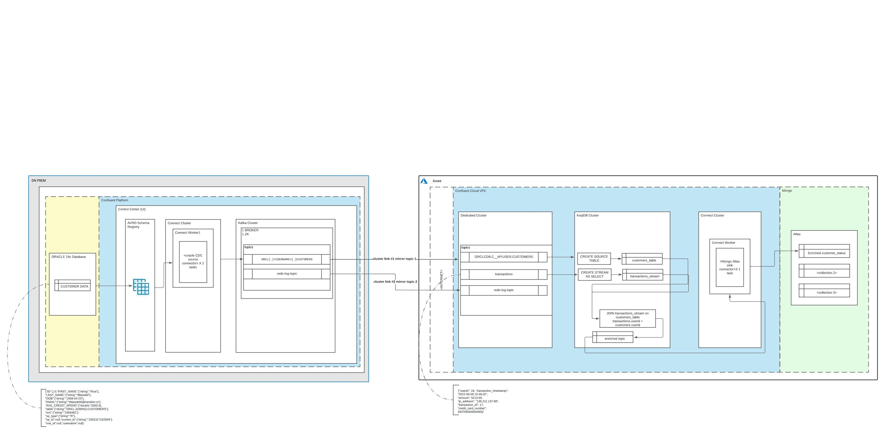

# CONTEXT
Confluent demo featuring oracle CDC connector, cluster linking, and a fully managed mongoDB Atlas sink.

Refer to this repo for setting up the oracle DB and data upon which this demo is built: https://github.com/sami2ahmed/demo-database-modernization. Tl;dr we are going to launch an onprem Confluent Platform (CP) and post an Oracle CDC Source connector to run there. Oracle has our CUSTOMERS table and we will CDC off of it to onprem Confluent then replicate the data up to a Confluent Cloud (CC) cluster running in Azure via Cluster Linking. We can demonstrate changes happening on the Oracle database arrive in the CC topic instaneously. Finally our data will then be landed in Mongo Atlas for search/dashboarding.



quickly show the data.
`ssh -i "sahmed-data-mod.pem" ec2-user@ec2-54-85-195-24.compute-1.amazonaws.com`
`SELECT * FROM CUSTOMERS ORDER BY ID;`

# PREREQUISITES
1. Dedicated Confluent Cloud cluster > [LINK](https://github.com/confluentinc/demo-database-modernization/blob/master/setup.md#set-up-confluent-cloud)
2. Docker
3. Oracle 19c database (I used AWS RDS) > [LINK](https://github.com/confluentinc/demo-database-modernization/blob/master/setup.md#create-an-oracle-db-instance)

# CONFLUENT PLATFORM CLUSTER
1. clone this repo, and then bring up confluent server/zookeeper, schema registry, and kafka connect via `docker-compose up -d`
***** to turn on TRACE log, you can do this before posting the connector *****
`curl -s -X PUT -H "Content-Type:application/json" \
    http://localhost:8083/admin/loggers/io.confluent.connect.oracle \
    -d '{"level": "TRACE"}' \
    | jq '.'`
2. confirm no connectors are running
`http GET "http://localhost:8083/connectors" | jq '.'`
3. view existing topics and create redo-log-topic, otherwise I would only get snapshots into the oracle topic, you can wait for changes to come and it'll autocreate redo-log, but to foolproof this. the connecftor writes all redo-log events to this stopic starting at the current SCN of the oracle RDS
`kafka-topics --bootstrap-server localhost:9092 --list`
`kafka-topics --bootstrap-server localhost:9092 --create --topic redo-log-topic --partitions 1`

# ORACLE CDC CONNECTOR
4. post oracle-cdc-config to connect api, whats going to happen is it will determine list of accessible talbes to be captured based on the include/exclude regex in the config we'll see, and will start with an initial snapshot of those 20 records i showed in the oracle RDS earlier..
it's also going to monitor my RDS for new tables, and it will request reconfiguration if new tables match my regex filters, there's a relationship of table to task in the connector, it creates a table placement plan that assigns tables to tasks
```
curl -X POST http://localhost:8083/connectors -H "Content-Type: application/json" -d  '{
        "name": "OracleCdcSourceConnectorSM",
        "config": {
                "connector.class": "io.confluent.connect.oracle.cdc.OracleCdcSourceConnector",
                "name": "OracleCdcSourceConnectorSM",
                "tasks.max":3,
                "oracle.server": "sami-oracle-rds.cndsjke6xo5r.us-west-2.rds.amazonaws.com",
                "oracle.port": 1521,
                "oracle.sid":"ORACLE",
                "oracle.username": "samiadmin",
                "oracle.password": "amoeba22!",
                "start.from":"snapshot",
                "redo.log.topic.name": "redo-log-topic",
                "redo.log.consumer.bootstrap.servers":"kafka:9092",

                "table.inclusion.regex": "ORACLE[.]SAMIADMIN[.]CUSTOMERS",
                "table.topic.name.template": "${databaseName}.${schemaName}.${tableName}",
                "confluent.topic.replication.factor":1,
                "redo.log.row.fetch.size": 1,
                "numeric.mapping": "best_fit_or_double",

                "key.converter":"io.confluent.connect.json.JsonSchemaConverter",
                "key.converter.schema.registry.url":"http://localhost:8081",
                "value.converter":"io.confluent.connect.json.JsonSchemaConverter",
                "value.converter.schema.registry.url":"http://localhost:8081",

                "topic.creation.groups":"redo",
                "topic.creation.redo.include":"redo-log-topic",
                "topic.creation.redo.replication.factor":1,
                "topic.creation.redo.partitions":1,
                "topic.creation.redo.cleanup.policy":"delete",
                "topic.creation.redo.retention.ms":1209600000,
                "topic.creation.default.replication.factor":1,
                "topic.creation.default.partitions":1,
                "topic.creation.default.cleanup.policy":"compact",
                "confluent.topic.bootstrap.servers":"kafka:9092",
                "topic.creation.enable": true
                }
        }'
```
5. confirm connector is up
`http GET "http://localhost:8083/connectors" | jq '.'`
6. confirm topic is created and populated by connector, you'll need to insert your username from oracle DB in the command below.
`kafka-console-consumer --bootstrap-server localhost:9092 --topic ORACLE.SAMIADMIN.CUSTOMERS --from-beginning`
7. in a different terminal you can run an update against the connector and confirm its being captured, i ran AWS RDS oracle and ssh'ed into it, then login as admin (user you setup with the appropriate connect privileges as described in demo-mod repo).
`update CUSTOMERS set avg_credit_spend = avg_credit_spend+300 where first_name = 'Patti';`
`COMMIT WORK;`
8. you can start a different terminal and kafka consumer to ensure changes like the update above come into the redo-log-topic
`kafka-console-consumer --bootstrap-server localhost:9092 --topic redo-log-topic --from-beginning`

# SCHEMA LINK

right so now i want to enable SR in this demo... for those that are newer this SR is a way to ensure data written to the topic is backwards compatible, and also gives us a catalog of data this is written to the topic... so i have some data lineage insight then... schema linking now allows me to take it a step further, i can take my schemas from on prem and replicate to cloud...

1. setup SR config on CP instance, the values below should be from your CC instance. this allows me to take the onprem SR and connect ccloud...
```
cat > schema-registry.config <<EOF
schema.registry.url=https://psrc-pg3n2.westus2.azure.confluent.cloud
basic.auth.credentials.source=USER_INFO
basic.auth.user.info=L4QCCP7MWSDL6V5R:By8iwHJfJS/UsRwPKAxMmCuAA3hv/WuxvB2EfojSmrYrnALEnixvIFwUhAe9ihTeeQOuW9ZrA3W

EOF
```
2. create the SR exporter, provide whatever names you'd prefer in the '<>'. this is the mechanism to actually bridge schemas, its like a little mini kafka connector
```
schema-exporter --create --name b2c-exporter --config-file schema-registry.config \
--context-type CUSTOM \
--context-name b2c \
--schema.registry.url http://schema-registry:8081
```

3. check status of exporter, insert your schema exporter name from #2 in the '<>'
`schema-exporter --describe --name b2c-exporter --schema.registry.url http://schema-registry:8081 | jq`

# CLUSTER LINK
1. get onprem cluster id -- THIS CHANGES EACH TIME YOU DOCKER UP AND DOWN
`kafka-cluster cluster-id --bootstrap-server kafka:9092`

2. export cluster id as variable, insert in <> below.
`export CP_CLUSTER_ID="l3G39RkgQVOJaKllQxmR3w"``

3. this is config for the cloud side, it tells cloud cluster it is destination of the link and that local cluster initiates the connection
```
cat > clusterlink-hybrid-dst.config <<EOF
link.mode=DESTINATION
connection.mode=INBOUND
EOF
```

*you must login to confluent cloud CLI and select cluster there before proceeding with 4 i.e.
`cflt login`
`cflt environment use env-d2m7y`
`cflt kafka cluster use lkc-j58xy8`

4. cluster link creation on CC side, insert your lkc including "lkc" in the '<>'
`confluent kafka link create from-on-prem --config-file clusterlink-hybrid-dst.config --source-cluster-id $CP_CLUSTER_ID --source-bootstrap-server 0.0.0.0 --cluster lkc-j58xy8`

5. tell CP it is source of the link & CP that it will originate connection to CC, insert your values in '<>'
```
cat > clusterlink-onprem-source.config <<EOF
link.mode=SOURCE
connection.mode=OUTBOUND bootstrap.servers=pkc-kj826.eastus2.azure.confluent.cloud:9092 security.protocol=SASL_SSL
sasl.mechanism=PLAIN sasl.jaas.config=org.apache.kafka.common.security.plain.PlainLoginModule required username='VVP2ST3W5BE22NOS' password='31B9dP7ncg5/YlzfbuLZfvKR4m0v4AcDHe6MsXmDtKoj5LNGhB6saTGKRYB/V5ts';
EOF
```

6. create link from CP side, insert your lkc like in step above
`kafka-cluster-links --bootstrap-server kafka:9092 --create --link from-on-prem --config-file clusterlink-onprem-source.config --cluster-id lkc-j58xy8`

7. Mirror specific topics
cflt kafka mirror create ORACLE.SAMIADMIN.CUSTOMERS --link from-on-prem
cflt kafka mirror create redo-log-topic --link from-on-prem

# TEARDOWN
(for the cp side, simply docker-compose down) 

1. delete mirror topics in ccloud
`cflt kafka topic delete ORACLE.SAMIADMIN.CUSTOMERS`
`cflt kafka topic delete redo-log-topic`

2. then you can delete cluster link
`cflt kafka link delete from-on-prem`


# PYTHON PRODUCER
WIP

# KSQLDB
WIP
